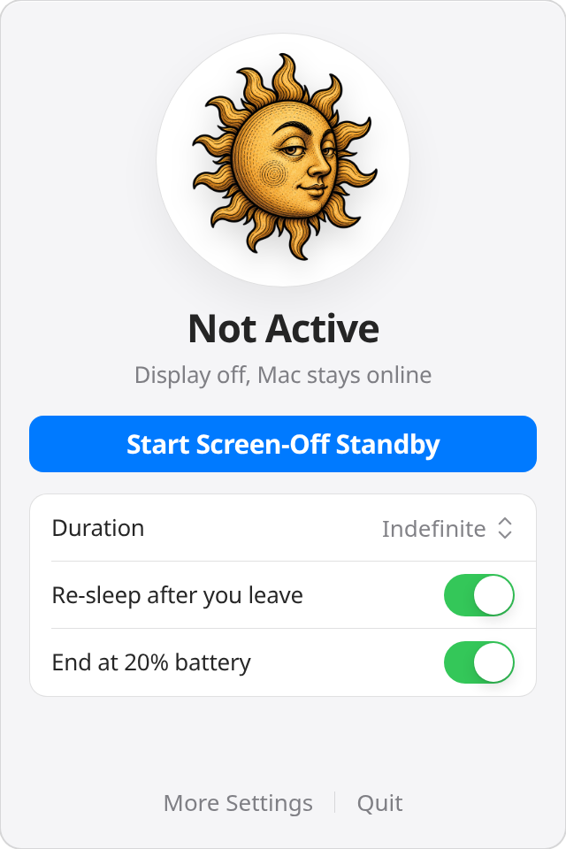
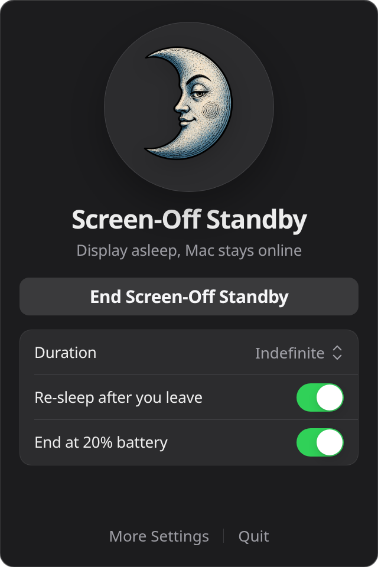
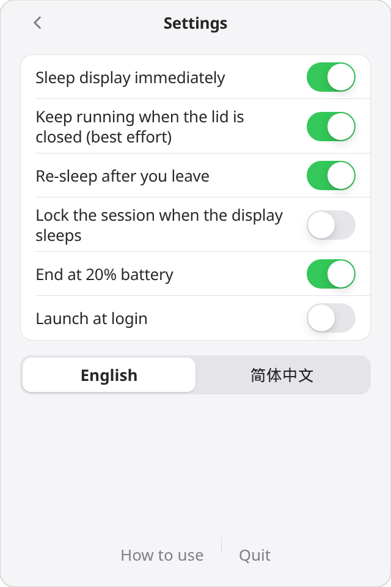
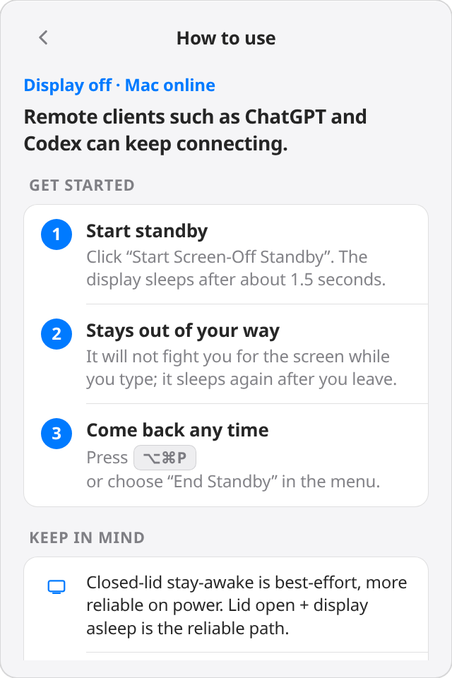

# Never Sleep

[English](README.md) | [简体中文](README.zh-CN.md) · **[Website](https://xyz-ai.app/never-sleep/)**

Keep a MacBook **awake with the display off**. Overnight downloads, a Mac mini-style server, remote sessions, or just a darker, lower-power desk — one click from the menu bar, plus an Agent-friendly CLI.

The UI is **English by default**, with Simplified Chinese when the system language is Chinese (or when you choose it in the menu).

## A look at the app

One left-click on the menu-bar sun opens a native AppKit panel. Tap the large sun to start — it flips to a moon and the display goes dark about 1.5 seconds later. The panel uses system Liquid Glass (with vibrancy on older macOS).

<table>
  <tr>
    <td align="center" valign="top" width="50%">
      
    </td>
    <td align="center" valign="top" width="50%">
      
    </td>
  </tr>
  <tr>
    <td align="center" valign="top">
      <sub><b>One tap to start</b> — the display sleeps, the Mac stays awake.</sub>
    </td>
    <td align="center" valign="top">
      <sub><b>Standby on</b> — screen off, the Mac keeps working.</sub>
    </td>
  </tr>
  <tr>
    <td align="center" valign="top" width="50%">
      
    </td>
    <td align="center" valign="top" width="50%">
      
    </td>
  </tr>
  <tr>
    <td align="center" valign="top">
      <sub><b>Every safeguard is a toggle</b> — in English or 简体中文.</sub>
    </td>
    <td align="center" valign="top">
      <sub><b>Built-in guide</b> — how it works, one tap away.</sub>
    </td>
  </tr>
</table>

## What it's for

The job is always the same: **display off, Mac awake**. That is useful for more than one ChatGPT session.

- **Unattended downloads** — leave a large transfer, App Store update, or Time Machine running overnight. The panel goes dark; the download does not.
- **MacBook as a mini server** — SSH, file sharing, a local site, or a home lab, closer to a Mac mini. **Lid open + display asleep is the reliable path**; closed-lid stay-awake is best effort.
- **Protect the display** — real display sleep, not brightness 0. Less heat and wear on the panel, and the desk stays dark.
- **Lower idle power** — the backlight is a large part of a MacBook’s idle draw. Sleep the panel; keep CPU, disk, and network available.
- **Remote sessions** — ChatGPT, Codex, Cursor, Screen Sharing, or SSH. If remote input wakes the panel, it goes dark again while you are away.
- **Long-running jobs** — compiles, encodes, backups, and syncs can finish overnight. Duration presets (1 / 3 / 8 hours, or until 08:00) and a battery floor stop it safely.

## Why this, instead of the usual tools

Built-in `caffeinate` and menu-bar apps like KeepingYouAwake / Amphetamine all mean “don’t sleep”. Their default path is almost always **keep the display on**, or they bury “allow display sleep” deep in options. Closed-lid stay-awake often needs an Enhancer, or rewriting `pmset`, and can leave power policy dirty after quit.

This product collapses the scenario to one job:

> When you leave, the display must go dark (panel, power, privacy). The machine must stay awake (downloads, a mini server, remote sessions).

Hard requirements:

1. **One-click start**: the first menu item is “Start Screen-Off Standby”. The display sleeps after 1.5 seconds; the system keeps running.
2. **Do not fight the person at the keyboard**: while you type, it never force-sleeps the display; after HID idle or a closed lid, it sleeps the display again.
3. **Remote input waking the panel is fine**: while you are away it reasserts `displaysleepnow`. If a remote session lights the screen with synthetic events, it goes dark again within a few seconds.
4. **There is always a way back**: global hotkey `⌥⌘P` (works with the display off), or the menu.
5. **Do not rewrite Energy Saver**: only in-process IOKit assertions. Quit, crash, or relaunch restores the clamshell flag. No leftover `pmset disablesleep 1`.
6. **Agent-friendly**: the same state is readable via `never-sleep status --json`. Codex can run `never-sleep on --for 8h`.

## Usage

### Menu bar (recommended)

On a Mac:

```bash
cargo build -p never-sleep --release
./scripts/package-macos.sh
open "dist/Never Sleep.app"
```

An anthropomorphic sun appears in the menu bar. Left-click it to open the control panel, then click the large sun to start. It flips into the moon before the display turns off about 1.5 seconds later; click the moon again to end standby. Right-click keeps the native fallback menu available.

| Option | Default | Meaning |
| --- | --- | --- |
| Sleep display immediately | On | The main feature: real display sleep, not brightness 0 |
| Keep running when the lid is closed | On | Best-effort; **lid open + display asleep is still the reliable path** |
| Re-sleep the display after you leave | On | Puts the panel back to sleep if a remote agent wakes it |
| Lock the session when the display sleeps | Off | Remote GUI needs an unlocked session, so this stays off |
| End when battery is below 20% | On | Avoid draining the pack in a bag |
| Duration | Indefinite | Also 1 / 3 / 8 hours, or until 08:00 local time |
| Language | English, or Chinese on a Chinese system | English / 简体中文; `--lang` and `NEVER_SLEEP_LANG` override |

### Command line

While the menu bar is running, commands talk to the same process:

```bash
never-sleep on --for 8h
never-sleep status --json
never-sleep off
never-sleep doctor      # assertions, battery, lid
never-sleep cleanup     # safety net after an abnormal exit
never-sleep explain
never-sleep --lang zh status
```

Over SSH with no menu bar, `never-sleep on` occupies the process in the foreground (like `caffeinate`). Ctrl-C ends it.

Minimal Agent snippet:

```bash
never-sleep on --for 8h
# …long-running task…
never-sleep off
```

### Language

Priority, English last as the fallback:

1. `--lang en|zh` or `NEVER_SLEEP_LANG=en|zh` for this process
2. The Language menu (saved in `config.toml`)
3. macOS preferred languages / Unix `LANG`
4. **English**

JSON output stays English so agents have a stable contract.

## How it works

Power semantics on macOS are split, which is why “display off + stay awake” is possible:

| Capability | Mechanism | Scope |
| --- | --- | --- |
| Block idle sleep | `PreventUserIdleSystemSleep` | Official, process-level, display sleep still allowed |
| Block disk idle | `PreventDiskIdle` | More reliable remote I/O |
| Keep the network up | `NetworkClientActive` | Less Wi-Fi dozing |
| Sleep the display | `pmset displaysleepnow`, else `IODisplayWrangler IORequestIdle` | Does not block system sleep |
| Closed lid, best effort | `PreventSystemSleep` (mainly AC) + RootDomain selector 12 to disable clamshell sleep + `IOCancelPowerChange` on `CanSystemSleep` | **Not guaranteed** on every model / OS |
| Watchdog | Reassert display sleep every 3s while you are away | Synthetic / remote HID |
| “Is a person here?” | `IOHIDSystem HIDIdleTime` + lid state | Synthetic events usually do not reset HID idle — that is what we want |

Deliberately not done:

- **No** default `sudo pmset -a disablesleep 1`. It writes system preferences, survives reboot, and a crashed app would leave the Mac unable to sleep.
- **No** `PreventUserIdleDisplaySleep` / `caffeinate -d`. Those keep the panel lit, which is the opposite of protecting it.

Closed-lid note (please read): with no external display, Apple prefers full-machine sleep on lid close; that is a thermal design. Selector 12 works on some Apple Silicon + newer OS versions and may be ignored on others. The UI says “best effort”. `never-sleep doctor` can check `pmset -g assertions`. The display-protection path is **lid open + display sleep**, which IOKit supports and which is easiest on the panel.

Safety nets:

- Standby ends on battery below the threshold (off AC)
- Standby ends on thermal `Critical`
- `~/Library/Application Support/Never Sleep/session.lock` records the pid; the next launch restores the clamshell flag if that process is dead
- The panic hook restores it as well

Architecture:

```
never-sleep-core   policy only (unit-tested on Linux)
never-sleep        CLI + macOS menu bar
```

The engine only emits `ApplyPower` / `SleepDisplay` / `LockSession` / `Notify`. The platform layer owns IOKit, so display-sleep policy does not depend on whether this machine can compile AppKit.

## Compared with common tools

| | Never Sleep | caffeinate | KeepingYouAwake | Amphetamine |
| --- | --- | --- | --- | --- |
| Display off by default | Yes, and it reasserts | only with `-i` | No | Session option |
| Re-sleep after a remote wake | Yes | No | No | No |
| Does not steal the screen while you are there | Yes | No | No | No |
| Closed lid | Best effort | `-s` on AC only | Explicitly unsupported | Stronger, often needs Enhancer |
| Rewrites system pmset | No | No | No | Some modes |
| JSON / Agent CLI | Yes | No | No | No |

## Development

Coding agents and contributors follow **test-first (TDD)** development. See [AGENTS.md](AGENTS.md) for the cycle, invariants, and where tests belong.

```bash
cargo fmt --all
cargo clippy --workspace --all-targets -- -D warnings
cargo test --workspace          # core tests on Linux or Mac
# Menu bar and IOKit link only on macOS
cargo build -p never-sleep --release   # on a Mac
```

Config: `~/Library/Application Support/Never Sleep/config.toml`  
IPC socket: `ipc.sock` in the same directory

Requires **Rust 1.88+** and macOS 12+. The menu bar runs as `LSUIElement` and does not take a Dock slot.

## License

MIT
